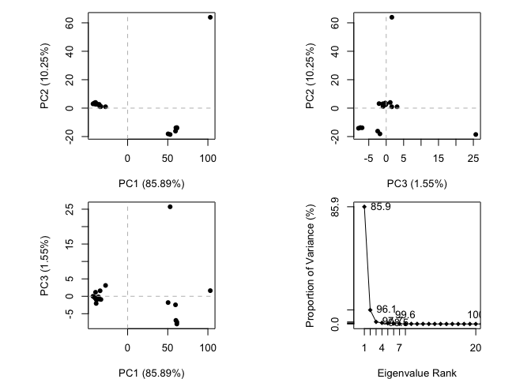
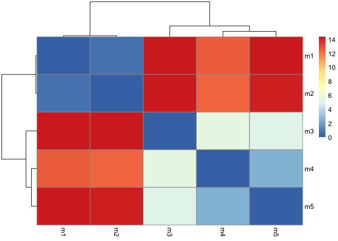
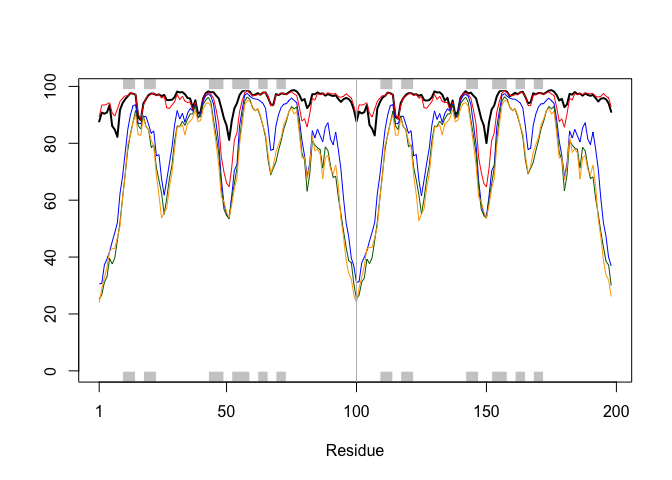
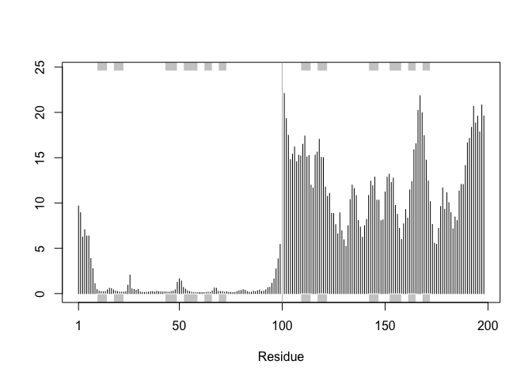
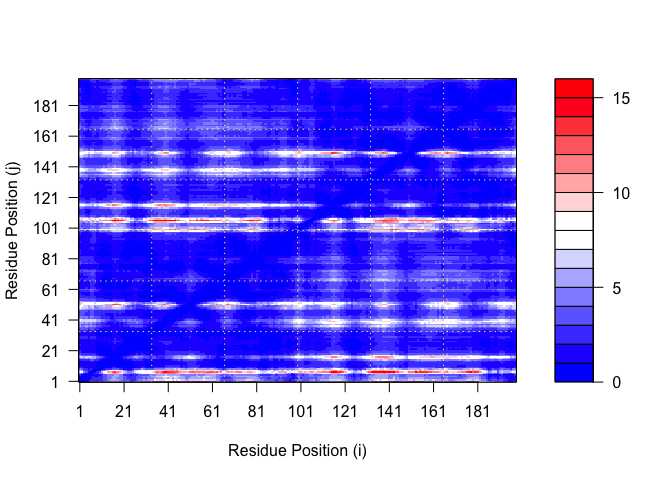
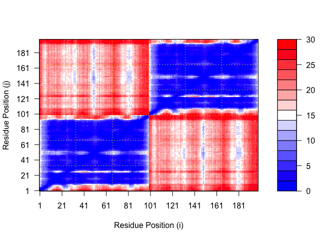
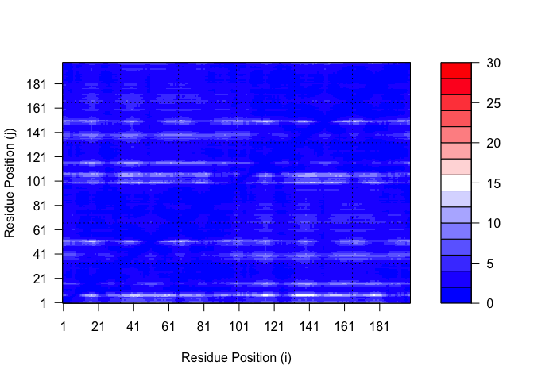
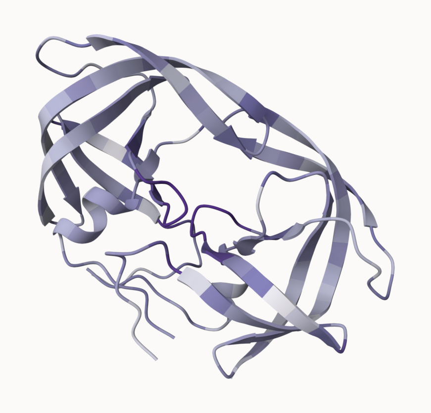

# Class 11: Structural Bioinformatics pt 2
Morgan Black (PID: A14904860)

Before looking at AlphaFold, we’ll finish the rest of Section 4 from
last class’ lab. (I’ve already done this in my previous Class 10 Quarto
document I submitted on Gradescope, but I’ll repeat it again here with
the class)

``` r
library(bio3d)
id <- "1ake_A"
aa <- get.seq(id)
```

    Warning in get.seq(id): Removing existing file: seqs.fasta

    Fetching... Please wait. Done.

``` r
aa
```

                 1        .         .         .         .         .         60 
    pdb|1AKE|A   MRIILLGAPGAGKGTQAQFIMEKYGIPQISTGDMLRAAVKSGSELGKQAKDIMDAGKLVT
                 1        .         .         .         .         .         60 

                61        .         .         .         .         .         120 
    pdb|1AKE|A   DELVIALVKERIAQEDCRNGFLLDGFPRTIPQADAMKEAGINVDYVLEFDVPDELIVDRI
                61        .         .         .         .         .         120 

               121        .         .         .         .         .         180 
    pdb|1AKE|A   VGRRVHAPSGRVYHVKFNPPKVEGKDDVTGEELTTRKDDQEETVRKRLVEYHQMTAPLIG
               121        .         .         .         .         .         180 

               181        .         .         .   214 
    pdb|1AKE|A   YYSKEAEAGNTKYAKVDGTKPVAEVRADLEKILG
               181        .         .         .   214 

    Call:
      read.fasta(file = outfile)

    Class:
      fasta

    Alignment dimensions:
      1 sequence rows; 214 position columns (214 non-gap, 0 gap) 

    + attr: id, ali, call

``` r
b <- blast.pdb(aa)
```

     Searching ... please wait (updates every 5 seconds) RID = N6Z41TCS013 
     ......
     Reporting 86 hits

``` r
head(b$hit.tbl)
```

            queryid subjectids identity alignmentlength mismatches gapopens q.start
    1 Query_3321061     1AKE_A  100.000             214          0        0       1
    2 Query_3321061     8BQF_A   99.533             214          1        0       1
    3 Query_3321061     4X8M_A   99.533             214          1        0       1
    4 Query_3321061     6S36_A   99.533             214          1        0       1
    5 Query_3321061     8Q2B_A   99.533             214          1        0       1
    6 Query_3321061     8RJ9_A   99.533             214          1        0       1
      q.end s.start s.end    evalue bitscore positives mlog.evalue pdb.id    acc
    1   214       1   214 1.58e-156      432    100.00    358.7458 1AKE_A 1AKE_A
    2   214      21   234 2.59e-156      433    100.00    358.2516 8BQF_A 8BQF_A
    3   214       1   214 2.83e-156      432    100.00    358.1630 4X8M_A 4X8M_A
    4   214       1   214 4.16e-156      432    100.00    357.7778 6S36_A 6S36_A
    5   214       1   214 1.10e-155      431     99.53    356.8054 8Q2B_A 8Q2B_A
    6   214       1   214 1.10e-155      431     99.53    356.8054 8RJ9_A 8RJ9_A

``` r
hits <- plot(b)
```

      * Possible cutoff values:    197 11 
                Yielding Nhits:    19 86 

      * Chosen cutoff value of:    197 
                Yielding Nhits:    19 


Top hits that we like from the blast results (find the identifiers):

``` r
hits$pdb.id
```

     [1] "1AKE_A" "8BQF_A" "4X8M_A" "6S36_A" "8Q2B_A" "8RJ9_A" "6RZE_A" "4X8H_A"
     [9] "3HPR_A" "1E4V_A" "5EJE_A" "1E4Y_A" "3X2S_A" "6HAP_A" "6HAM_A" "4K46_A"
    [17] "4NP6_A" "3GMT_A" "4PZL_A"

``` r
files <- get.pdb(hits$pdb.id, path="pdbs", split=TRUE, gzip=TRUE)
```

    Warning in get.pdb(hits$pdb.id, path = "pdbs", split = TRUE, gzip = TRUE):
    pdbs/1AKE.pdb.gz exists. Skipping download

    Warning in get.pdb(hits$pdb.id, path = "pdbs", split = TRUE, gzip = TRUE):
    pdbs/8BQF.pdb.gz exists. Skipping download

    Warning in get.pdb(hits$pdb.id, path = "pdbs", split = TRUE, gzip = TRUE):
    pdbs/4X8M.pdb.gz exists. Skipping download

    Warning in get.pdb(hits$pdb.id, path = "pdbs", split = TRUE, gzip = TRUE):
    pdbs/6S36.pdb.gz exists. Skipping download

    Warning in get.pdb(hits$pdb.id, path = "pdbs", split = TRUE, gzip = TRUE):
    pdbs/8Q2B.pdb.gz exists. Skipping download

    Warning in get.pdb(hits$pdb.id, path = "pdbs", split = TRUE, gzip = TRUE):
    pdbs/8RJ9.pdb.gz exists. Skipping download

    Warning in get.pdb(hits$pdb.id, path = "pdbs", split = TRUE, gzip = TRUE):
    pdbs/6RZE.pdb.gz exists. Skipping download

    Warning in get.pdb(hits$pdb.id, path = "pdbs", split = TRUE, gzip = TRUE):
    pdbs/4X8H.pdb.gz exists. Skipping download

    Warning in get.pdb(hits$pdb.id, path = "pdbs", split = TRUE, gzip = TRUE):
    pdbs/3HPR.pdb.gz exists. Skipping download

    Warning in get.pdb(hits$pdb.id, path = "pdbs", split = TRUE, gzip = TRUE):
    pdbs/1E4V.pdb.gz exists. Skipping download

    Warning in get.pdb(hits$pdb.id, path = "pdbs", split = TRUE, gzip = TRUE):
    pdbs/5EJE.pdb.gz exists. Skipping download

    Warning in get.pdb(hits$pdb.id, path = "pdbs", split = TRUE, gzip = TRUE):
    pdbs/1E4Y.pdb.gz exists. Skipping download

    Warning in get.pdb(hits$pdb.id, path = "pdbs", split = TRUE, gzip = TRUE):
    pdbs/3X2S.pdb.gz exists. Skipping download

    Warning in get.pdb(hits$pdb.id, path = "pdbs", split = TRUE, gzip = TRUE):
    pdbs/6HAP.pdb.gz exists. Skipping download

    Warning in get.pdb(hits$pdb.id, path = "pdbs", split = TRUE, gzip = TRUE):
    pdbs/6HAM.pdb.gz exists. Skipping download

    Warning in get.pdb(hits$pdb.id, path = "pdbs", split = TRUE, gzip = TRUE):
    pdbs/4K46.pdb.gz exists. Skipping download

    Warning in get.pdb(hits$pdb.id, path = "pdbs", split = TRUE, gzip = TRUE):
    pdbs/4NP6.pdb.gz exists. Skipping download

    Warning in get.pdb(hits$pdb.id, path = "pdbs", split = TRUE, gzip = TRUE):
    pdbs/3GMT.pdb.gz exists. Skipping download

    Warning in get.pdb(hits$pdb.id, path = "pdbs", split = TRUE, gzip = TRUE):
    pdbs/4PZL.pdb.gz exists. Skipping download


      |                                                                            
      |                                                                      |   0%
      |                                                                            
      |====                                                                  |   5%
      |                                                                            
      |=======                                                               |  11%
      |                                                                            
      |===========                                                           |  16%
      |                                                                            
      |===============                                                       |  21%
      |                                                                            
      |==================                                                    |  26%
      |                                                                            
      |======================                                                |  32%
      |                                                                            
      |==========================                                            |  37%
      |                                                                            
      |=============================                                         |  42%
      |                                                                            
      |=================================                                     |  47%
      |                                                                            
      |=====================================                                 |  53%
      |                                                                            
      |=========================================                             |  58%
      |                                                                            
      |============================================                          |  63%
      |                                                                            
      |================================================                      |  68%
      |                                                                            
      |====================================================                  |  74%
      |                                                                            
      |=======================================================               |  79%
      |                                                                            
      |===========================================================           |  84%
      |                                                                            
      |===============================================================       |  89%
      |                                                                            
      |==================================================================    |  95%
      |                                                                            
      |======================================================================| 100%

Above, we’ve downloaded the ADK structures but viewing all of them is
messy. They need to be aligned and superimposed.

Align and fit (superimpose) the structures:

``` r
pdbs <- pdbaln(files, fit = TRUE, exefile="msa")
```

    Reading PDB files:
    pdbs/split_chain/1AKE_A.pdb
    pdbs/split_chain/8BQF_A.pdb
    pdbs/split_chain/4X8M_A.pdb
    pdbs/split_chain/6S36_A.pdb
    pdbs/split_chain/8Q2B_A.pdb
    pdbs/split_chain/8RJ9_A.pdb
    pdbs/split_chain/6RZE_A.pdb
    pdbs/split_chain/4X8H_A.pdb
    pdbs/split_chain/3HPR_A.pdb
    pdbs/split_chain/1E4V_A.pdb
    pdbs/split_chain/5EJE_A.pdb
    pdbs/split_chain/1E4Y_A.pdb
    pdbs/split_chain/3X2S_A.pdb
    pdbs/split_chain/6HAP_A.pdb
    pdbs/split_chain/6HAM_A.pdb
    pdbs/split_chain/4K46_A.pdb
    pdbs/split_chain/4NP6_A.pdb
    pdbs/split_chain/3GMT_A.pdb
    pdbs/split_chain/4PZL_A.pdb
       PDB has ALT records, taking A only, rm.alt=TRUE
    .   PDB has ALT records, taking A only, rm.alt=TRUE
    ..   PDB has ALT records, taking A only, rm.alt=TRUE
    .   PDB has ALT records, taking A only, rm.alt=TRUE
    .   PDB has ALT records, taking A only, rm.alt=TRUE
    .   PDB has ALT records, taking A only, rm.alt=TRUE
    ..   PDB has ALT records, taking A only, rm.alt=TRUE
    ..   PDB has ALT records, taking A only, rm.alt=TRUE
    ....   PDB has ALT records, taking A only, rm.alt=TRUE
    .   PDB has ALT records, taking A only, rm.alt=TRUE
    ....

    Extracting sequences

    pdb/seq: 1   name: pdbs/split_chain/1AKE_A.pdb 
       PDB has ALT records, taking A only, rm.alt=TRUE
    pdb/seq: 2   name: pdbs/split_chain/8BQF_A.pdb 
       PDB has ALT records, taking A only, rm.alt=TRUE
    pdb/seq: 3   name: pdbs/split_chain/4X8M_A.pdb 
    pdb/seq: 4   name: pdbs/split_chain/6S36_A.pdb 
       PDB has ALT records, taking A only, rm.alt=TRUE
    pdb/seq: 5   name: pdbs/split_chain/8Q2B_A.pdb 
       PDB has ALT records, taking A only, rm.alt=TRUE
    pdb/seq: 6   name: pdbs/split_chain/8RJ9_A.pdb 
       PDB has ALT records, taking A only, rm.alt=TRUE
    pdb/seq: 7   name: pdbs/split_chain/6RZE_A.pdb 
       PDB has ALT records, taking A only, rm.alt=TRUE
    pdb/seq: 8   name: pdbs/split_chain/4X8H_A.pdb 
    pdb/seq: 9   name: pdbs/split_chain/3HPR_A.pdb 
       PDB has ALT records, taking A only, rm.alt=TRUE
    pdb/seq: 10   name: pdbs/split_chain/1E4V_A.pdb 
    pdb/seq: 11   name: pdbs/split_chain/5EJE_A.pdb 
       PDB has ALT records, taking A only, rm.alt=TRUE
    pdb/seq: 12   name: pdbs/split_chain/1E4Y_A.pdb 
    pdb/seq: 13   name: pdbs/split_chain/3X2S_A.pdb 
    pdb/seq: 14   name: pdbs/split_chain/6HAP_A.pdb 
    pdb/seq: 15   name: pdbs/split_chain/6HAM_A.pdb 
       PDB has ALT records, taking A only, rm.alt=TRUE
    pdb/seq: 16   name: pdbs/split_chain/4K46_A.pdb 
       PDB has ALT records, taking A only, rm.alt=TRUE
    pdb/seq: 17   name: pdbs/split_chain/4NP6_A.pdb 
    pdb/seq: 18   name: pdbs/split_chain/3GMT_A.pdb 
    pdb/seq: 19   name: pdbs/split_chain/4PZL_A.pdb 

## PCA

``` r
pc <- pca(pdbs)
plot(pc)
```



``` r
#To just plot PC1. vs PC2
plot(pc, pc.axes=c(1:2))
```


To examine in more detail what PC1 is capturing, we’ll plot the loadings
or make a movie of moving along PC1.

``` r
mktrj(pc, pc=1, file="pc1.pdb")
```

Now we’ll move on to the Class 11 lab sheet after working through how to
use Alphafold and Mol\* together to look at different models of the
HIV-Pr dimer.

``` r
pdb_files <- list.files(path='/Users/mobla1/Documents/Graduate/Fall 2024/BGGN213/Class 11/dimer_test_23119',
                        pattern="*.pdb",
                        full.names = TRUE)

basename(pdb_files)
```

    [1] "dimer_test_23119_unrelaxed_rank_001_alphafold2_multimer_v3_model_1_seed_000.pdb"
    [2] "dimer_test_23119_unrelaxed_rank_002_alphafold2_multimer_v3_model_5_seed_000.pdb"
    [3] "dimer_test_23119_unrelaxed_rank_003_alphafold2_multimer_v3_model_4_seed_000.pdb"
    [4] "dimer_test_23119_unrelaxed_rank_004_alphafold2_multimer_v3_model_2_seed_000.pdb"
    [5] "dimer_test_23119_unrelaxed_rank_005_alphafold2_multimer_v3_model_3_seed_000.pdb"

``` r
library(bio3d)
pdbs <- pdbaln(pdb_files, fit=TRUE, exefile="msa")
```

    Reading PDB files:
    /Users/mobla1/Documents/Graduate/Fall 2024/BGGN213/Class 11/dimer_test_23119/dimer_test_23119_unrelaxed_rank_001_alphafold2_multimer_v3_model_1_seed_000.pdb
    /Users/mobla1/Documents/Graduate/Fall 2024/BGGN213/Class 11/dimer_test_23119/dimer_test_23119_unrelaxed_rank_002_alphafold2_multimer_v3_model_5_seed_000.pdb
    /Users/mobla1/Documents/Graduate/Fall 2024/BGGN213/Class 11/dimer_test_23119/dimer_test_23119_unrelaxed_rank_003_alphafold2_multimer_v3_model_4_seed_000.pdb
    /Users/mobla1/Documents/Graduate/Fall 2024/BGGN213/Class 11/dimer_test_23119/dimer_test_23119_unrelaxed_rank_004_alphafold2_multimer_v3_model_2_seed_000.pdb
    /Users/mobla1/Documents/Graduate/Fall 2024/BGGN213/Class 11/dimer_test_23119/dimer_test_23119_unrelaxed_rank_005_alphafold2_multimer_v3_model_3_seed_000.pdb
    .....

    Extracting sequences

    pdb/seq: 1   name: /Users/mobla1/Documents/Graduate/Fall 2024/BGGN213/Class 11/dimer_test_23119/dimer_test_23119_unrelaxed_rank_001_alphafold2_multimer_v3_model_1_seed_000.pdb 
    pdb/seq: 2   name: /Users/mobla1/Documents/Graduate/Fall 2024/BGGN213/Class 11/dimer_test_23119/dimer_test_23119_unrelaxed_rank_002_alphafold2_multimer_v3_model_5_seed_000.pdb 
    pdb/seq: 3   name: /Users/mobla1/Documents/Graduate/Fall 2024/BGGN213/Class 11/dimer_test_23119/dimer_test_23119_unrelaxed_rank_003_alphafold2_multimer_v3_model_4_seed_000.pdb 
    pdb/seq: 4   name: /Users/mobla1/Documents/Graduate/Fall 2024/BGGN213/Class 11/dimer_test_23119/dimer_test_23119_unrelaxed_rank_004_alphafold2_multimer_v3_model_2_seed_000.pdb 
    pdb/seq: 5   name: /Users/mobla1/Documents/Graduate/Fall 2024/BGGN213/Class 11/dimer_test_23119/dimer_test_23119_unrelaxed_rank_005_alphafold2_multimer_v3_model_3_seed_000.pdb 

``` r
rd <- rmsd(pdbs, fit=T)
```

    Warning in rmsd(pdbs, fit = T): No indices provided, using the 198 non NA positions

``` r
range(rd)
```

    [1]  0.000 14.376

``` r
#install.packages("pheatmap")
library(pheatmap)

colnames(rd) <- paste0("m", 1:5)
rownames(rd) <- paste0("m", 1:5)
pheatmap(rd)
```



``` r
# Read a reference PDB structure
pdb <- read.pdb("1hsg")
```

      Note: Accessing on-line PDB file

``` r
plotb3(pdbs$b[1,], typ="l", lwd=2, sse=pdb)
points(pdbs$b[2,], typ="l", col="red")
points(pdbs$b[3,], typ="l", col="blue")
points(pdbs$b[4,], typ="l", col="darkgreen")
points(pdbs$b[5,], typ="l", col="orange")
abline(v=100, col="gray")
```



Improve the superposition of the models (find the most consistent core
across all models):

``` r
core <- core.find(pdbs)
```

     core size 197 of 198  vol = 4916.723 
     core size 196 of 198  vol = 4311.504 
     core size 195 of 198  vol = 4101.471 
     core size 194 of 198  vol = 3907.146 
     core size 193 of 198  vol = 3711.949 
     core size 192 of 198  vol = 3546.534 
     core size 191 of 198  vol = 3440.459 
     core size 190 of 198  vol = 3317.592 
     core size 189 of 198  vol = 3220.101 
     core size 188 of 198  vol = 3142.08 
     core size 187 of 198  vol = 3066.812 
     core size 186 of 198  vol = 3015.913 
     core size 185 of 198  vol = 2959.991 
     core size 184 of 198  vol = 2913.761 
     core size 183 of 198  vol = 2880.945 
     core size 182 of 198  vol = 2848.102 
     core size 181 of 198  vol = 2857.022 
     core size 180 of 198  vol = 2871.261 
     core size 179 of 198  vol = 2905.713 
     core size 178 of 198  vol = 2953.792 
     core size 177 of 198  vol = 3020.862 
     core size 176 of 198  vol = 3087.233 
     core size 175 of 198  vol = 3110.003 
     core size 174 of 198  vol = 3129.613 
     core size 173 of 198  vol = 3135.096 
     core size 172 of 198  vol = 3092.292 
     core size 171 of 198  vol = 3036.019 
     core size 170 of 198  vol = 2948.003 
     core size 169 of 198  vol = 2886.906 
     core size 168 of 198  vol = 2829.363 
     core size 167 of 198  vol = 2746.384 
     core size 166 of 198  vol = 2671.196 
     core size 165 of 198  vol = 2600.855 
     core size 164 of 198  vol = 2534.66 
     core size 163 of 198  vol = 2464.308 
     core size 162 of 198  vol = 2390.178 
     core size 161 of 198  vol = 2322.478 
     core size 160 of 198  vol = 2236.706 
     core size 159 of 198  vol = 2160.483 
     core size 158 of 198  vol = 2077.288 
     core size 157 of 198  vol = 2003.604 
     core size 156 of 198  vol = 1939.947 
     core size 155 of 198  vol = 1859.195 
     core size 154 of 198  vol = 1781.09 
     core size 153 of 198  vol = 1699.107 
     core size 152 of 198  vol = 1622.565 
     core size 151 of 198  vol = 1546.326 
     core size 150 of 198  vol = 1473.016 
     core size 149 of 198  vol = 1414.092 
     core size 148 of 198  vol = 1352.553 
     core size 147 of 198  vol = 1295.283 
     core size 146 of 198  vol = 1247.006 
     core size 145 of 198  vol = 1203.967 
     core size 144 of 198  vol = 1163.014 
     core size 143 of 198  vol = 1110.959 
     core size 142 of 198  vol = 1064.676 
     core size 141 of 198  vol = 1028.462 
     core size 140 of 198  vol = 986.124 
     core size 139 of 198  vol = 944.007 
     core size 138 of 198  vol = 895.918 
     core size 137 of 198  vol = 853.511 
     core size 136 of 198  vol = 827.98 
     core size 135 of 198  vol = 796.876 
     core size 134 of 198  vol = 772.766 
     core size 133 of 198  vol = 743.11 
     core size 132 of 198  vol = 707.652 
     core size 131 of 198  vol = 669.174 
     core size 130 of 198  vol = 634.657 
     core size 129 of 198  vol = 594.036 
     core size 128 of 198  vol = 559.156 
     core size 127 of 198  vol = 525.972 
     core size 126 of 198  vol = 493.192 
     core size 125 of 198  vol = 466.475 
     core size 124 of 198  vol = 438.434 
     core size 123 of 198  vol = 410.726 
     core size 122 of 198  vol = 401.382 
     core size 121 of 198  vol = 391.762 
     core size 120 of 198  vol = 362.085 
     core size 119 of 198  vol = 338.185 
     core size 118 of 198  vol = 312.34 
     core size 117 of 198  vol = 282.177 
     core size 116 of 198  vol = 262.216 
     core size 115 of 198  vol = 241.578 
     core size 114 of 198  vol = 225.153 
     core size 113 of 198  vol = 204.138 
     core size 112 of 198  vol = 185.039 
     core size 111 of 198  vol = 162.729 
     core size 110 of 198  vol = 146.182 
     core size 109 of 198  vol = 133.353 
     core size 108 of 198  vol = 123.208 
     core size 107 of 198  vol = 109.228 
     core size 106 of 198  vol = 98.824 
     core size 105 of 198  vol = 89.736 
     core size 104 of 198  vol = 81.207 
     core size 103 of 198  vol = 74.188 
     core size 102 of 198  vol = 67.043 
     core size 101 of 198  vol = 62.044 
     core size 100 of 198  vol = 58.433 
     core size 99 of 198  vol = 55.151 
     core size 98 of 198  vol = 51.114 
     core size 97 of 198  vol = 45.798 
     core size 96 of 198  vol = 41.161 
     core size 95 of 198  vol = 35.619 
     core size 94 of 198  vol = 29.785 
     core size 93 of 198  vol = 23.234 
     core size 92 of 198  vol = 16.67 
     core size 91 of 198  vol = 9.46 
     core size 90 of 198  vol = 4.595 
     core size 89 of 198  vol = 3.161 
     core size 88 of 198  vol = 2.678 
     core size 87 of 198  vol = 2.293 
     core size 86 of 198  vol = 1.936 
     core size 85 of 198  vol = 1.619 
     core size 84 of 198  vol = 1.367 
     core size 83 of 198  vol = 1.09 
     core size 82 of 198  vol = 0.906 
     core size 81 of 198  vol = 0.764 
     core size 80 of 198  vol = 0.649 
     core size 79 of 198  vol = 0.596 
     core size 78 of 198  vol = 0.53 
     core size 77 of 198  vol = 0.486 
     FINISHED: Min vol ( 0.5 ) reached

``` r
core.inds <- print(core, vol=0.5)
```

    # 78 positions (cumulative volume <= 0.5 Angstrom^3) 
      start end length
    1    10  25     16
    2    28  48     21
    3    53  93     41

``` r
#New directory in Class 11 folder with the new superposed coordinates, can view in Mol*
xyz <- pdbfit(pdbs, core.inds, outpath="corefit_structures")
```

``` r
#Look at the RMSF between positions

rf <- rmsf(xyz)

plotb3(rf, sse=pdb)
abline(v=100, col="gray", ylab="RMSF")
```



``` r
library(jsonlite)

# Listing of all PAE JSON files
pae_files <- list.files(path='/Users/mobla1/Documents/Graduate/Fall 2024/BGGN213/Class 11/dimer_test_23119',
                        pattern=".*model.*\\.json",
                        full.names = TRUE)
```

``` r
pae1 <- read_json(pae_files[1],simplifyVector = TRUE)
pae2 <- read_json(pae_files[2],simplifyVector = TRUE)
pae3 <- read_json(pae_files[3],simplifyVector = TRUE)
pae4 <- read_json(pae_files[4],simplifyVector = TRUE)
pae5 <- read_json(pae_files[5],simplifyVector = TRUE)

attributes(pae1)
```

    $names
    [1] "plddt"   "max_pae" "pae"     "ptm"     "iptm"   

``` r
#Maximum PAE values for each model (lower score is better!)
pae1$max_pae
```

    [1] 15.47656

``` r
pae2$max_pae
```

    [1] 16.125

``` r
pae3$max_pae
```

    [1] 29.07812

``` r
pae4$max_pae
```

    [1] 28.89062

``` r
pae5$max_pae
```

    [1] 29.32812

``` r
plot.dmat(pae1$pae, 
          xlab="Residue Position (i)",
          ylab="Residue Position (j)")
```



``` r
plot.dmat(pae5$pae, 
          xlab="Residue Position (i)",
          ylab="Residue Position (j)")
```



Re-do the plot for model 1 but with the same data range as the plot for
model 5:

``` r
plot.dmat(pae1$pae, 
          xlab="Residue Position (i)",
          ylab="Residue Position (j)",
          grid.col = "black",
          zlim=c(0,30))
```



Residue conservation from alignment file:

``` r
aln_file <- list.files(path='/Users/mobla1/Documents/Graduate/Fall 2024/BGGN213/Class 11/dimer_test_23119',
                       pattern=".a3m$",
                        full.names = TRUE)
aln_file
```

    [1] "/Users/mobla1/Documents/Graduate/Fall 2024/BGGN213/Class 11/dimer_test_23119/dimer_test_23119.a3m"

``` r
aln <- read.fasta(aln_file[1], to.upper = TRUE)
```

    [1] " ** Duplicated sequence id's: 101 **"
    [2] " ** Duplicated sequence id's: 101 **"

``` r
#How many sequences are in this alignment?
dim(aln$ali)
```

    [1] 5378  132

``` r
#Score residue conservation
sim <- conserv(aln)
```

``` r
plotb3(sim[1:99], sse=trim.pdb(pdb, chain="A"),
       ylab="Conservation Score")
```


``` r
#Generate consensus sequence with high cutoff value to see conserved residues
con <- consensus(aln, cutoff = 0.9)
con$seq
```

      [1] "-" "-" "-" "-" "-" "-" "-" "-" "-" "-" "-" "-" "-" "-" "-" "-" "-" "-"
     [19] "-" "-" "-" "-" "-" "-" "D" "T" "G" "A" "-" "-" "-" "-" "-" "-" "-" "-"
     [37] "-" "-" "-" "-" "-" "-" "-" "-" "-" "-" "-" "-" "-" "-" "-" "-" "-" "-"
     [55] "-" "-" "-" "-" "-" "-" "-" "-" "-" "-" "-" "-" "-" "-" "-" "-" "-" "-"
     [73] "-" "-" "-" "-" "-" "-" "-" "-" "-" "-" "-" "-" "-" "-" "-" "-" "-" "-"
     [91] "-" "-" "-" "-" "-" "-" "-" "-" "-" "-" "-" "-" "-" "-" "-" "-" "-" "-"
    [109] "-" "-" "-" "-" "-" "-" "-" "-" "-" "-" "-" "-" "-" "-" "-" "-" "-" "-"
    [127] "-" "-" "-" "-" "-" "-"

``` r
#Visualize these functionally important residue sites
m1.pdb <- read.pdb(pdb_files[1])
occ <- vec2resno(c(sim[1:99], sim[1:99]), m1.pdb$atom$resno)
write.pdb(m1.pdb, o=occ, file="m1_conserv.pdb")
```

``` r

```


