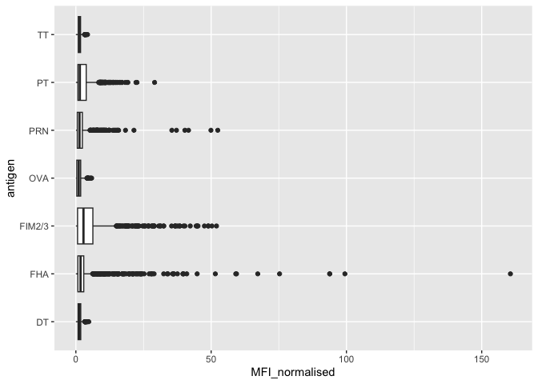

# Class 15: Pertussis and CMI-PB mini project
Morgan Black (PID A14904860)

The CDC tracks pertussis case numbers which can be accessed through
their website
[here](https://www.cdc.gov/pertussis/php/surveillance/pertussis-cases-by-year.html?CDC_AAref_Val=https://www.cdc.gov/pertussis/surv-reporting/cases-by-year.html)

First we need to “scrape” this data to import it into R using the
**datapasta** package.

``` r
cdc <- data.frame(
  year = c(
    1922L, 1923L, 1924L, 1925L,
    1926L, 1927L, 1928L, 1929L, 1930L, 1931L,
    1932L, 1933L, 1934L, 1935L, 1936L,
    1937L, 1938L, 1939L, 1940L, 1941L, 1942L,
    1943L, 1944L, 1945L, 1946L, 1947L,
    1948L, 1949L, 1950L, 1951L, 1952L,
    1953L, 1954L, 1955L, 1956L, 1957L, 1958L,
    1959L, 1960L, 1961L, 1962L, 1963L,
    1964L, 1965L, 1966L, 1967L, 1968L, 1969L,
    1970L, 1971L, 1972L, 1973L, 1974L,
    1975L, 1976L, 1977L, 1978L, 1979L, 1980L,
    1981L, 1982L, 1983L, 1984L, 1985L,
    1986L, 1987L, 1988L, 1989L, 1990L,
    1991L, 1992L, 1993L, 1994L, 1995L, 1996L,
    1997L, 1998L, 1999L, 2000L, 2001L,
    2002L, 2003L, 2004L, 2005L, 2006L, 2007L,
    2008L, 2009L, 2010L, 2011L, 2012L,
    2013L, 2014L, 2015L, 2016L, 2017L, 2018L,
    2019L, 2020L, 2021L, 2022L, 2024L
  ),
  cases = c(
    107473, 164191, 165418, 152003,
    202210, 181411, 161799, 197371,
    166914, 172559, 215343, 179135, 265269,
    180518, 147237, 214652, 227319, 103188,
    183866, 222202, 191383, 191890, 109873,
    133792, 109860, 156517, 74715, 69479,
    120718, 68687, 45030, 37129, 60886,
    62786, 31732, 28295, 32148, 40005,
    14809, 11468, 17749, 17135, 13005, 6799,
    7717, 9718, 4810, 3285, 4249, 3036,
    3287, 1759, 2402, 1738, 1010, 2177, 2063,
    1623, 1730, 1248, 1895, 2463, 2276,
    3589, 4195, 2823, 3450, 4157, 4570,
    2719, 4083, 6586, 4617, 5137, 7796, 6564,
    7405, 7298, 7867, 7580, 9771, 11647,
    25827, 25616, 15632, 10454, 13278,
    16858, 27550, 18719, 48277, 28639, 32971,
    20762, 17972, 18975, 15609, 18617,
    6124, 2116, 3044, 23544
  )
)
```

``` r
library(ggplot2)
baseplot <- ggplot(cdc) + aes(year, cases) +
              geom_point() +
              geom_line()
               
baseplot
```


Now let’s add the data of vaccine rollout.

``` r
baseplot +
  theme_bw() +
  geom_vline(xintercept=1946, col="blue") + #When the wP vaccine came out
  geom_vline(xintercept=1996, col="red") + #Switch from wP to the new aP vaccine
  geom_vline(xintercept=2020, col="green") + #COVID pandemic
  geom_vline(xintercept=2003, col="gray") #first big uptick after the new vaccine, seems to confer resistance for less time than the wP vaccine
```


## CMI_PB (Computational Models of Immunity - Pertussis Boost)

This project collects and makes freely available data about the immune
response to pertussis vaccination. Access the data via an API which
returns JSON format. Use **jsonlite** package to read in the data:

``` r
library(jsonlite)

subject <- read_json("https://www.cmi-pb.org/api/v5/subject", 
                     simplifyVector = TRUE)

head(subject)
```

      subject_id infancy_vac biological_sex              ethnicity  race
    1          1          wP         Female Not Hispanic or Latino White
    2          2          wP         Female Not Hispanic or Latino White
    3          3          wP         Female                Unknown White
    4          4          wP           Male Not Hispanic or Latino Asian
    5          5          wP           Male Not Hispanic or Latino Asian
    6          6          wP         Female Not Hispanic or Latino White
      year_of_birth date_of_boost      dataset
    1    1986-01-01    2016-09-12 2020_dataset
    2    1968-01-01    2019-01-28 2020_dataset
    3    1983-01-01    2016-10-10 2020_dataset
    4    1988-01-01    2016-08-29 2020_dataset
    5    1991-01-01    2016-08-29 2020_dataset
    6    1988-01-01    2016-10-10 2020_dataset

### Q: How many subjects are in this dataset?

``` r
nrow(subject)
```

    [1] 172

### Q: How many male/female subjects are there?

``` r
table(subject$biological_sex)
```


    Female   Male 
       112     60 

### Q: How many wP and aP do we have?

``` r
table(subject$infancy_vac)
```


    aP wP 
    87 85 

### Q: Breakdown of biological sex and race?

``` r
table(subject$race, subject$biological_sex)
```

                                               
                                                Female Male
      American Indian/Alaska Native                  0    1
      Asian                                         32   12
      Black or African American                      2    3
      More Than One Race                            15    4
      Native Hawaiian or Other Pacific Islander      1    1
      Unknown or Not Reported                       14    7
      White                                         48   32

### Q: Does this breakdown relfect the US population?

No!

The dataset is still large and useful, so although it will not reflect
the population, it’s still worth looking at.

``` r
table(subject$dataset)
```


    2020_dataset 2021_dataset 2022_dataset 2023_dataset 
              60           36           22           54 

``` r
specimen <- read_json("http://cmi-pb.org/api/v5/specimen", 
                      simplifyVector = TRUE)
ab_titer <- read_json("http://cmi-pb.org/api/v5/plasma_ab_titer", 
                      simplifyVector = TRUE)
```

We want to merge or “join” these tables so we can have all the info we
need for antibody measurements

``` r
library(dplyr)
```


    Attaching package: 'dplyr'

    The following objects are masked from 'package:stats':

        filter, lag

    The following objects are masked from 'package:base':

        intersect, setdiff, setequal, union

``` r
meta <- inner_join(subject, specimen)
```

    Joining with `by = join_by(subject_id)`

``` r
head(meta)
```

      subject_id infancy_vac biological_sex              ethnicity  race
    1          1          wP         Female Not Hispanic or Latino White
    2          1          wP         Female Not Hispanic or Latino White
    3          1          wP         Female Not Hispanic or Latino White
    4          1          wP         Female Not Hispanic or Latino White
    5          1          wP         Female Not Hispanic or Latino White
    6          1          wP         Female Not Hispanic or Latino White
      year_of_birth date_of_boost      dataset specimen_id
    1    1986-01-01    2016-09-12 2020_dataset           1
    2    1986-01-01    2016-09-12 2020_dataset           2
    3    1986-01-01    2016-09-12 2020_dataset           3
    4    1986-01-01    2016-09-12 2020_dataset           4
    5    1986-01-01    2016-09-12 2020_dataset           5
    6    1986-01-01    2016-09-12 2020_dataset           6
      actual_day_relative_to_boost planned_day_relative_to_boost specimen_type
    1                           -3                             0         Blood
    2                            1                             1         Blood
    3                            3                             3         Blood
    4                            7                             7         Blood
    5                           11                            14         Blood
    6                           32                            30         Blood
      visit
    1     1
    2     2
    3     3
    4     4
    5     5
    6     6

Now we join ‘ab_titer’ and ‘meta’

``` r
abdata <- inner_join(ab_titer, meta)
```

    Joining with `by = join_by(specimen_id)`

``` r
nrow(abdata)
```

    [1] 52576

``` r
table(abdata$isotype)
```


      IgE   IgG  IgG1  IgG2  IgG3  IgG4 
     6698  5389 10117 10124 10124 10124 

``` r
table(abdata$antigen)
```


        ACT   BETV1      DT   FELD1     FHA  FIM2/3   LOLP1     LOS Measles     OVA 
       1970    1970    4978    1970    5372    4978    1970    1970    1970    4978 
        PD1     PRN      PT     PTM   Total      TT 
       1970    5372    5372    1970     788    4978 

Let’s begin by looking at IgG

``` r
igg <- filter(abdata, isotype == "IgG")
head(igg)
```

      specimen_id isotype is_antigen_specific antigen        MFI MFI_normalised
    1           1     IgG                TRUE      PT   68.56614       3.736992
    2           1     IgG                TRUE     PRN  332.12718       2.602350
    3           1     IgG                TRUE     FHA 1887.12263      34.050956
    4          19     IgG                TRUE      PT   20.11607       1.096366
    5          19     IgG                TRUE     PRN  976.67419       7.652635
    6          19     IgG                TRUE     FHA   60.76626       1.096457
       unit lower_limit_of_detection subject_id infancy_vac biological_sex
    1 IU/ML                 0.530000          1          wP         Female
    2 IU/ML                 6.205949          1          wP         Female
    3 IU/ML                 4.679535          1          wP         Female
    4 IU/ML                 0.530000          3          wP         Female
    5 IU/ML                 6.205949          3          wP         Female
    6 IU/ML                 4.679535          3          wP         Female
                   ethnicity  race year_of_birth date_of_boost      dataset
    1 Not Hispanic or Latino White    1986-01-01    2016-09-12 2020_dataset
    2 Not Hispanic or Latino White    1986-01-01    2016-09-12 2020_dataset
    3 Not Hispanic or Latino White    1986-01-01    2016-09-12 2020_dataset
    4                Unknown White    1983-01-01    2016-10-10 2020_dataset
    5                Unknown White    1983-01-01    2016-10-10 2020_dataset
    6                Unknown White    1983-01-01    2016-10-10 2020_dataset
      actual_day_relative_to_boost planned_day_relative_to_boost specimen_type
    1                           -3                             0         Blood
    2                           -3                             0         Blood
    3                           -3                             0         Blood
    4                           -3                             0         Blood
    5                           -3                             0         Blood
    6                           -3                             0         Blood
      visit
    1     1
    2     1
    3     1
    4     1
    5     1
    6     1

Make a boxplot of IgG antigen levels- this will be a plot of MFI vs
antigen

``` r
ggplot(igg) +
  aes(MFI_normalised, antigen) +
  geom_boxplot()
```



Color by infancy vaccine:

``` r
ggplot(igg) +
  aes(MFI_normalised, antigen, col=infancy_vac) +
  geom_boxplot()
```


Ideally we’d like to see how these levels change over time relative to
the booster shot dose time

``` r
table(abdata$visit)
```


       1    2    3    4    5    6    7    8    9   10   11   12 
    8280 8280 8420 6565 6565 6210 5810  815  735  686  105  105 

``` r
ggplot(igg) +
  aes(MFI_normalised, antigen) +
  geom_boxplot() +
  facet_wrap(~infancy_vac)
```


``` r
ggplot(igg) +
  aes(MFI_normalised, antigen) +
  geom_boxplot() +
  facet_wrap(~visit)
```


``` r
ggplot(igg) +
  aes(MFI_normalised, antigen, col=infancy_vac) +
  geom_boxplot() +
  facet_wrap(~visit)
```


``` r
abdata_2021 <- abdata %>% filter(dataset == "2021_dataset")

abdata_2021 %>% filter(isotype == "IgG", antigen == "PT") %>%
  ggplot() +
  aes(planned_day_relative_to_boost, MFI_normalised, col= infancy_vac, group=subject_id) +
  geom_point() +
  geom_line() +
  geom_vline(xintercept=0, linetype="dashed") +
  geom_vline(xintercept=14, linetype="dashed") +
  labs(title="2021 dataset IgG PT",
       subtitle = "Day 0 (pre-booster) and 14 (apparent peak levels) marked by dashed lines") 
```


Let’s look at the same data from 2020 and compare plots:

``` r
abdata_2020 <- abdata %>% filter(dataset == "2020_dataset")

abdata_2020 %>% filter(isotype == "IgG", antigen == "PT") %>%
  ggplot() +
  aes(planned_day_relative_to_boost, MFI_normalised, col= infancy_vac, group=subject_id) +
  geom_point() +
  geom_line() +
  geom_vline(xintercept=0, linetype="dashed") +
  geom_vline(xintercept=14, linetype="dashed") +
  labs(title="2020 dataset IgG PT",
       subtitle = "Day 0 (pre-booster) and 14 (apparent peak levels) marked by dashed lines") 
```


The 2020 dataset seems to have been interrupted by the pandemic with
some patients coming back for their final collection point far after
other patients. However the dynamics between day 0 to day 120 seems
similar to the 2021 dataset, other than the two pink lines (two patients
that initially got the aP vaccine) that have large upward/downward
spikes in normalized MFI compared to the other patients.

## CMI-PB RNAseq Data

``` r
url <- "https://www.cmi-pb.org/api/v2/rnaseq?versioned_ensembl_gene_id=eq.ENSG00000211896.7"

rna <- read_json(url, simplifyVector = TRUE) 
```

``` r
ssrna <- inner_join(rna, meta)
```

    Joining with `by = join_by(specimen_id)`

Plot time course of gene expression for the IGHG1 gene

``` r
ggplot(ssrna) +
  aes(visit, tpm, group=subject_id) +
  geom_point() +
  geom_line(alpha=0.2)
```


It’s hard to tell individual subjects by this plot, but it seems that
the peak expression hits for most patients around visit 4 after the
booster shot. If this corresponds to days, then this is about a week
earlier than the peak IgG antigen levels seen in the previous plots, but
aligns around the point where antigen levels start to increase for each
patient. If this doesn’t correspond to days post-booster, then it’s hard
to tell how this correlates time-wise with the antigen tracking plot
above.

Color by infancy_vac:

``` r
ggplot(ssrna) +
  aes(tpm, col=infancy_vac) +
  geom_boxplot() +
  facet_wrap(vars(visit))
```


Focus in on a particular visit (visit 4) to see if there are differences
between aP and wP:

``` r
ssrna %>%  
  filter(visit==4) %>% 
  ggplot() +
    aes(tpm, col=infancy_vac) + geom_density() + 
    geom_rug() 
```


