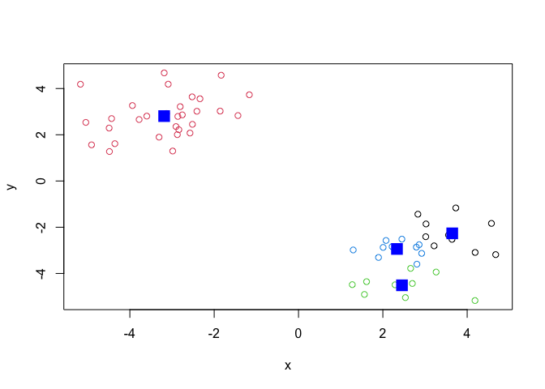

# Class 7: Machine Learning 1
Morgan Black (PID A14904860)

Sample data to do clustering analysis where we know what the answer
should be. Use the ‘rnorm()’ function.

``` r
#Make two individual histograms, one centered around 3 and one centered 
#around -3.
hist( rnorm(150000, mean=3) )
```


``` r
hist( rnorm(150000, mean=-3) )
```


``` r
#Combine these two distributions on one histogram plot.
n=15000
hist( c(rnorm(n, mean=3), rnorm(n, mean=-3)))
```


``` r
#Make a clustering plot with rnorm() data clustered around +3 and -3
n=30
x <- c(rnorm(n, mean=3), rnorm(n, mean=-3))
y <- rev(x) #This just reverses the x axis data
z <- cbind(x,y) #Combine x and y to data matrix by column

plot(z)
```


## K-means clustering

Main function for k-means clustering is ‘kmeans()’

``` r
#Need two inputs for kmeans(): x (numeric data matrix), and centers (number of 
#clusters or a set of initial cluster centers which are randomly chosen from x 
#as the initial centers).

#K-means clustering with two clusters from the rnorm data above.
km <- kmeans(z, centers = 2)

#Print out the cluster membership vector (which cluster each point belongs to).
km$cluster
```

     [1] 2 2 2 2 2 2 2 2 2 2 2 2 2 2 2 2 2 2 2 2 2 2 2 2 2 2 2 2 2 2 1 1 1 1 1 1 1 1
    [39] 1 1 1 1 1 1 1 1 1 1 1 1 1 1 1 1 1 1 1 1 1 1

``` r
#Color the clusters differently by assigning the values in km$cluster vector 
#to the color argument, since col=1 is black and col=2 is red.
plot(z, col=km$cluster)

#Now visualize cluster centers on the current plot:
points(km$centers, col="blue", pch=15, cex=2)
```


## Can you cluster the data in ‘z’ to 4 clusters?

``` r
km4 <- kmeans(z, centers = 4)
plot(z, col=km4$cluster)
points(km4$centers, col="blue", pch=15, cex=2)
```



``` r
#This data does not look like it has 4 separate clusters, but kmeans() will 
#always cluster based on what input/argument you give it.
```

## Hierarchical clustering

The main function of hierarchical clustering in base R is called
‘hclust()’. Unlike “kmeans()’, we can’t just put in our data as input.
First you need a distance matrix from the data

``` r
d <- dist(z)
hc <- hclust(d)
hc
```


    Call:
    hclust(d = d)

    Cluster method   : complete 
    Distance         : euclidean 
    Number of objects: 60 

## There is a specific hclust plot method

``` r
#Plot a cluster dendogram 
plot(hc)
abline(h=10, col="red") 
```


To get the main clustering result (membership vector, which cluster each
point belongs to), you can cut the tree at a given height. To do this,
use ‘cutree()’

``` r
grps <- cutree(hc, h=10)
grps
```

     [1] 1 1 1 1 1 1 1 1 1 1 1 1 1 1 1 1 1 1 1 1 1 1 1 1 1 1 1 1 1 1 2 2 2 2 2 2 2 2
    [39] 2 2 2 2 2 2 2 2 2 2 2 2 2 2 2 2 2 2 2 2 2 2

``` r
plot(z, col=grps)
```


## Principal Component Analysis

Visualize major similarities and differences by reducing dimensionality

\###PCA of UK food data

``` r
url <- "https://tinyurl.com/UK-foods"
x <- read.csv(url, row.names=1)
#head(x)

#Bar plots, not very useful
barplot(as.matrix(x), beside=T, col=rainbow(nrow(x)))
```


``` r
barplot(as.matrix(x), beside=F, col=rainbow(nrow(x)))
```


``` r
#Pairwise plot between each pairs of countries, slightly more useful in the 
#sense that all of the N. Ireland plots have more outliers compared to the 
#other pairwise plots, but still hard to read. 
pairs(x, col=rainbow(10), pch=16)
```


The main function to do PCA in base R is called ‘prcomp()’

``` r
#Need to transpose dataset to switch the rows and columns:
#t(x)

pca <- prcomp(t(x))
summary(pca)
```

    Importance of components:
                                PC1      PC2      PC3       PC4
    Standard deviation     324.1502 212.7478 73.87622 2.921e-14
    Proportion of Variance   0.6744   0.2905  0.03503 0.000e+00
    Cumulative Proportion    0.6744   0.9650  1.00000 1.000e+00

``` r
#Proportion of variance tells us what portion of the original variance in the 
#data is explained/captured by each PC
```

``` r
#What's inside the PCA object we just calculated?
attributes(pca)
```

    $names
    [1] "sdev"     "rotation" "center"   "scale"    "x"       

    $class
    [1] "prcomp"

Make the main result figure, called a “PC plot” (or score plot, or
ordination plot, or PC1 vs PC2 plot),

``` r
pca$x
```

                     PC1         PC2        PC3           PC4
    England   -144.99315   -2.532999 105.768945 -9.152022e-15
    Wales     -240.52915 -224.646925 -56.475555  5.560040e-13
    Scotland   -91.86934  286.081786 -44.415495 -6.638419e-13
    N.Ireland  477.39164  -58.901862  -4.877895  1.329771e-13

``` r
plot(pca$x[,1], pca$x[,2], 
     col=c("black", "red", "blue", "darkgreen"), 
     xlab="PC1 (67.4%)", ylab="PC2 (29%)",
     xlim=c(-270, 500))
text(pca$x[,1], pca$x[,2], colnames(x), col=c("black", "red", "blue", "darkgreen"))
```


``` r
#Variable loadings plot to see how the original variables contribute to our 
#PC1 axis since PC1 accounts for most of the variance.
par(mar=c(10, 3, 0.35, 0))
barplot( pca$rotation[,1], las=2 )
```


