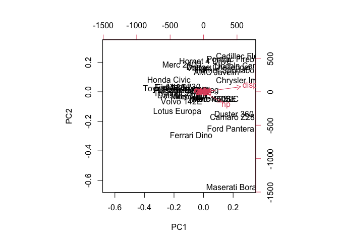
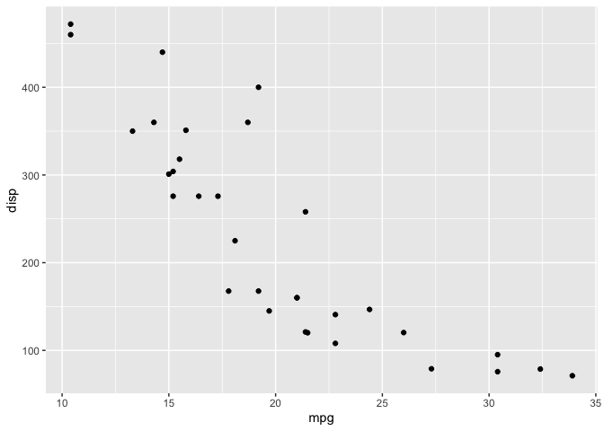
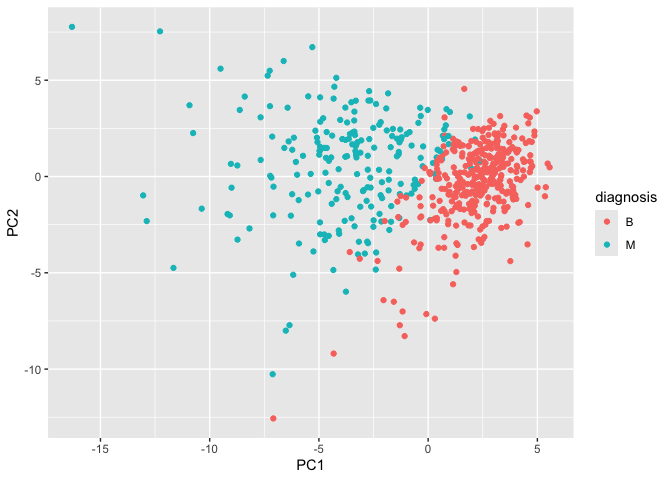

# Class 8: PCA Mini Project
Morgan Black (PID A14904860)

## Side note before starting about scaling:

``` r
#Mean value of each column in mtcars dataset
apply(mtcars, 2, mean)
```

           mpg        cyl       disp         hp       drat         wt       qsec 
     20.090625   6.187500 230.721875 146.687500   3.596563   3.217250  17.848750 
            vs         am       gear       carb 
      0.437500   0.406250   3.687500   2.812500 

``` r
#Spread of each column via standard deviation
apply(mtcars, 2, sd)
```

            mpg         cyl        disp          hp        drat          wt 
      6.0269481   1.7859216 123.9386938  68.5628685   0.5346787   0.9784574 
           qsec          vs          am        gear        carb 
      1.7869432   0.5040161   0.4989909   0.7378041   1.6152000 

``` r
pca <- prcomp(mtcars)
biplot(pca)
```



Without scaling, the columns are measured in different units and the pca
analysis will be biased towards the units with higher counts/larger
spread.

``` r
#Scale the data
mtscale <- scale(mtcars)
head(mtscale)
```

                             mpg        cyl        disp         hp       drat
    Mazda RX4          0.1508848 -0.1049878 -0.57061982 -0.5350928  0.5675137
    Mazda RX4 Wag      0.1508848 -0.1049878 -0.57061982 -0.5350928  0.5675137
    Datsun 710         0.4495434 -1.2248578 -0.99018209 -0.7830405  0.4739996
    Hornet 4 Drive     0.2172534 -0.1049878  0.22009369 -0.5350928 -0.9661175
    Hornet Sportabout -0.2307345  1.0148821  1.04308123  0.4129422 -0.8351978
    Valiant           -0.3302874 -0.1049878 -0.04616698 -0.6080186 -1.5646078
                                wt       qsec         vs         am       gear
    Mazda RX4         -0.610399567 -0.7771651 -0.8680278  1.1899014  0.4235542
    Mazda RX4 Wag     -0.349785269 -0.4637808 -0.8680278  1.1899014  0.4235542
    Datsun 710        -0.917004624  0.4260068  1.1160357  1.1899014  0.4235542
    Hornet 4 Drive    -0.002299538  0.8904872  1.1160357 -0.8141431 -0.9318192
    Hornet Sportabout  0.227654255 -0.4637808 -0.8680278 -0.8141431 -0.9318192
    Valiant            0.248094592  1.3269868  1.1160357 -0.8141431 -0.9318192
                            carb
    Mazda RX4          0.7352031
    Mazda RX4 Wag      0.7352031
    Datsun 710        -1.1221521
    Hornet 4 Drive    -1.1221521
    Hornet Sportabout -0.5030337
    Valiant           -1.1221521

``` r
#Now look at the mean and standard deviation of each column
round(apply(mtscale, 2, mean), 3)
```

     mpg  cyl disp   hp drat   wt qsec   vs   am gear carb 
       0    0    0    0    0    0    0    0    0    0    0 

``` r
round(apply(mtscale, 2, sd), 3)
```

     mpg  cyl disp   hp drat   wt qsec   vs   am gear carb 
       1    1    1    1    1    1    1    1    1    1    1 

Let’s plot to make sure the scaled data still has the same
relationships. Plot ‘mpg’ vs ‘disp’ for both the original and scaled
data

``` r
library(ggplot2)
ggplot(mtcars, aes(mpg, disp)) +
         geom_point()
```



``` r
ggplot(mtscale, aes(mpg, disp)) +
          geom_point()
```


``` r
pca2 <- prcomp(mtscale)
biplot(pca2)
```


# Breast Cancer FNA Data

## Preparing the data

First download the csv file from the class website and put it in the
current working directory thru Finder, then read it into R

``` r
wisc.df <- read.csv("WisconsinCancer.csv", 
                    row.names=1)
#head(wisc.df)
```

Omit the ‘diagnosis’ column and create a new dataset

``` r
wisc.data <- wisc.df[,-1]
```

Create a new vector that contains the diagnosis column from the original
dataset.

``` r
diagnosis <- as.factor(wisc.df$diagnosis)
```

### Q1: How many observations are in this dataset?

``` r
nrow(wisc.df)
```

    [1] 569

### Q2: How many of the observations have a malignant diagnosis?

``` r
table(wisc.df$diagnosis)
```


      B   M 
    357 212 

There are 212 malignant diagnoses.

### Q3: How many variables/features in the data are suffixed with ’\_mean’?

``` r
length(grep("_mean", colnames(wisc.data)))
```

    [1] 10

There are 10.

## Prinicpal Component Analysis

Check the mean and standard deviation of the features to determine if
the data should be scaled.

``` r
round(colMeans(wisc.data), 3)
```

                radius_mean            texture_mean          perimeter_mean 
                     14.127                  19.290                  91.969 
                  area_mean         smoothness_mean        compactness_mean 
                    654.889                   0.096                   0.104 
             concavity_mean     concave.points_mean           symmetry_mean 
                      0.089                   0.049                   0.181 
     fractal_dimension_mean               radius_se              texture_se 
                      0.063                   0.405                   1.217 
               perimeter_se                 area_se           smoothness_se 
                      2.866                  40.337                   0.007 
             compactness_se            concavity_se       concave.points_se 
                      0.025                   0.032                   0.012 
                symmetry_se    fractal_dimension_se            radius_worst 
                      0.021                   0.004                  16.269 
              texture_worst         perimeter_worst              area_worst 
                     25.677                 107.261                 880.583 
           smoothness_worst       compactness_worst         concavity_worst 
                      0.132                   0.254                   0.272 
       concave.points_worst          symmetry_worst fractal_dimension_worst 
                      0.115                   0.290                   0.084 

``` r
round(apply(wisc.data, 2, sd), 3)
```

                radius_mean            texture_mean          perimeter_mean 
                      3.524                   4.301                  24.299 
                  area_mean         smoothness_mean        compactness_mean 
                    351.914                   0.014                   0.053 
             concavity_mean     concave.points_mean           symmetry_mean 
                      0.080                   0.039                   0.027 
     fractal_dimension_mean               radius_se              texture_se 
                      0.007                   0.277                   0.552 
               perimeter_se                 area_se           smoothness_se 
                      2.022                  45.491                   0.003 
             compactness_se            concavity_se       concave.points_se 
                      0.018                   0.030                   0.006 
                symmetry_se    fractal_dimension_se            radius_worst 
                      0.008                   0.003                   4.833 
              texture_worst         perimeter_worst              area_worst 
                      6.146                  33.603                 569.357 
           smoothness_worst       compactness_worst         concavity_worst 
                      0.023                   0.157                   0.209 
       concave.points_worst          symmetry_worst fractal_dimension_worst 
                      0.066                   0.062                   0.018 

Perform PCA on wisc.data with scaling.

``` r
wisc.pr <- prcomp(wisc.data, scale=TRUE)
x <- summary(wisc.pr)
x$importance
```

                                PC1      PC2      PC3      PC4      PC5      PC6
    Standard deviation     3.644394 2.385656 1.678675 1.407352 1.284029 1.098798
    Proportion of Variance 0.442720 0.189710 0.093930 0.066020 0.054960 0.040250
    Cumulative Proportion  0.442720 0.632430 0.726360 0.792390 0.847340 0.887590
                                 PC7       PC8       PC9      PC10      PC11
    Standard deviation     0.8217178 0.6903746 0.6456739 0.5921938 0.5421399
    Proportion of Variance 0.0225100 0.0158900 0.0139000 0.0116900 0.0098000
    Cumulative Proportion  0.9101000 0.9259800 0.9398800 0.9515700 0.9613700
                                PC12      PC13      PC14      PC15      PC16
    Standard deviation     0.5110395 0.4912815 0.3962445 0.3068142 0.2826001
    Proportion of Variance 0.0087100 0.0080500 0.0052300 0.0031400 0.0026600
    Cumulative Proportion  0.9700700 0.9781200 0.9833500 0.9864900 0.9891500
                                PC17      PC18      PC19      PC20      PC21
    Standard deviation     0.2437192 0.2293878 0.2224356 0.1765203 0.1731268
    Proportion of Variance 0.0019800 0.0017500 0.0016500 0.0010400 0.0010000
    Cumulative Proportion  0.9911300 0.9928800 0.9945300 0.9955700 0.9965700
                                PC22      PC23      PC24      PC25      PC26
    Standard deviation     0.1656484 0.1560155 0.1343689 0.1244238 0.0904303
    Proportion of Variance 0.0009100 0.0008100 0.0006000 0.0005200 0.0002700
    Cumulative Proportion  0.9974900 0.9983000 0.9989000 0.9994200 0.9996900
                                 PC27      PC28       PC29       PC30
    Standard deviation     0.08306903 0.0398665 0.02736427 0.01153451
    Proportion of Variance 0.00023000 0.0000500 0.00002000 0.00000000
    Cumulative Proportion  0.99992000 0.9999700 1.00000000 1.00000000

``` r
#Plot the proportion of variance accounted for by each PC
plot(x$importance[2,], typ='b')
```


### Q4: What proportion of the original variance is captured by the first PC?

About 44% of the variance is captured by PC1.

### Q5: How many PCs are required to describe at least 70% of the original variance?

Three principal components are required to describe at least 70% of the
variance (PC3 cumulative proportion is ~72.64%).

### Q6: How many PCs are required to describe at least 90% of the original variance?

Seven prinicpal components are required to describe at least 90% of the
variance (PC7 cumulative proportion is ~91%).

``` r
#biplot(wisc.pr)
```

### Q7: What stands out to you about this biplot?

This plot is not understandable at all and is much too crowded to make
any conclusions.

Plot the observations by PC1 and PC2:

``` r
#attributes(wisc.pr)
#head(wisc.pr)
plot(wisc.pr$x, col=diagnosis,
     xlab="PC1", ylab="PC2")
```


Plot the observations by PC1 and PC3:

``` r
plot(wisc.pr$x[,1], wisc.pr$x[,3], col=diagnosis,
     xlab="PC1", ylab="PC3")
```


### Q8: What do you notice about the two previous plots?

There is a cleaner more clear separation between clusters in the PC1 vs
PC2 plot than the PC1 vs PC3 plot, indicating that PC2 explains more
variance than PC3.

Use ggplot2 to make some nicer figures.

``` r
df <- as.data.frame(wisc.pr$x)
df$diagnosis <- diagnosis

library(ggplot2)

ggplot(df) +
  aes(PC1, PC2, col=diagnosis) +
  geom_point()
```



## Variance explained

``` r
#Variance of each component
pr.var <- wisc.pr$sdev^2
head(pr.var)
```

    [1] 13.281608  5.691355  2.817949  1.980640  1.648731  1.207357

``` r
#Variance explained by each PC
pve <- pr.var/sum(pr.var)

plot(pve, xlab="Principal Component",
     ylab="Proportion of Variance Explained",
     ylim=c(0,1), type="o")
```


``` r
#Scree plot of the same data but in a bar plot with labels for each PC
barplot(pve, ylab="Percent of Variance Explained",
        names.arg=paste0("PC", 1:length(pve)), las=2, axes=FALSE)
axis(2, at=pve, labels=round(pve,2)*100) #Creates y-axis bar label showing 
```


``` r
                                          #percentages rather than proportion


#ggplot based graph instead of base R bar plot
#install.packages("factoextra")
library(factoextra)
```

    Welcome! Want to learn more? See two factoextra-related books at https://goo.gl/ve3WBa

``` r
fviz_eig(wisc.pr, addlabels = TRUE)
```


## Communicating PCA results

### Q9: For the first PC, what is the component of the loading vector for the feature ‘concave.points_mean’? This tells us how much this original feature contributes to the first PC.

``` r
wisc.pr$rotation["concave.points_mean",1]
```

    [1] -0.2608538

## Hierarchical clustering

``` r
data.scaled <- scale(wisc.data)
data.dist <- dist(data.scaled)
wisc.hclust <- hclust(data.dist)
plot(wisc.hclust)
abline(a=19, b=0, col="red", lty=2)
```


### Q10: What’s the height where this model has 4 clusters?

19

``` r
wisc.hclust.clusters <- cutree(wisc.hclust, k=4)
table(wisc.hclust.clusters, diagnosis)
```

                        diagnosis
    wisc.hclust.clusters   B   M
                       1  12 165
                       2   2   5
                       3 343  40
                       4   0   2

Explore different methods to combine points in hierarchical clustering.

``` r
wisc.hclust.single <- hclust(data.dist, method="single")
wisc.hclust.cluster.single <- cutree(wisc.hclust.single, k=4)
table(wisc.hclust.cluster.single, diagnosis)
```

                              diagnosis
    wisc.hclust.cluster.single   B   M
                             1 356 209
                             2   1   0
                             3   0   2
                             4   0   1

``` r
wisc.hclust.complete <- hclust(data.dist, method="complete")
wisc.hclust.cluster.complete <- cutree(wisc.hclust.complete, k=4)
table(wisc.hclust.cluster.complete, diagnosis)
```

                                diagnosis
    wisc.hclust.cluster.complete   B   M
                               1  12 165
                               2   2   5
                               3 343  40
                               4   0   2

``` r
wisc.hclust.average <- hclust(data.dist, method="average")
wisc.hclust.cluster.average <- cutree(wisc.hclust.average, k=4)
table(wisc.hclust.cluster.average, diagnosis)
```

                               diagnosis
    wisc.hclust.cluster.average   B   M
                              1 355 209
                              2   2   0
                              3   0   1
                              4   0   2

``` r
wisc.hclust.ward.D2 <- hclust(data.dist, method="ward.D2")
wisc.hclust.cluster.ward.D2 <- cutree(wisc.hclust.ward.D2, k=4)
table(wisc.hclust.cluster.ward.D2, diagnosis)
```

                               diagnosis
    wisc.hclust.cluster.ward.D2   B   M
                              1   0 115
                              2   6  48
                              3 337  48
                              4  14   1

## Q12: The “complete” method seems to give the best results compared to the expert diagnoses, giving less false positive/negative results but it is unclear whether this is a good thing or just fitting the data to match the experts conclusions.

Now use PCA results to cluster, using the “ward.D2” method

``` r
d<- dist(wisc.pr$x[,1:7])
hc <- hclust(d, method="ward.D2")
plot(hc)
```


Cut the tree to yield 2 clusters

``` r
grps <- cutree(hc, k=2)
table(grps)
```

    grps
      1   2 
    216 353 

Compare to the expert diagnoses of “M” vs “B”

``` r
table(diagnosis, grps)
```

             grps
    diagnosis   1   2
            B  28 329
            M 188  24

### Q13: How well does this model separate out the two diagnoses?

This separates out the two diagnoses fairly well, but it is saying there
are 28 false benign and 24 false malignant diagnoses from the analysis
done here.

``` r
table(diagnosis, wisc.hclust.clusters)
```

             wisc.hclust.clusters
    diagnosis   1   2   3   4
            B  12   2 343   0
            M 165   5  40   2

### Q14: How well does the earlier hierarchical clustering model (before PCA) do in terms of separating out the diagnoses?

This model results in less false benign results compared to the expert
diagnoses results. However, there are much more false malignant results
in this model than in the PCA-based clustering model.

``` r
#plot(wisc.pr$x[,1:2], col=grps)

g <- as.factor(grps)
#levels(g)
g <- relevel(g,2)
#levels(g)
plot(wisc.pr$x[,1:2], col=g)
```


``` r
plot(wisc.pr$x[,1:2], col=diagnosis)
```


## Prediction

``` r
url <- "https://tinyurl.com/new-samples-CSV"
new <- read.csv(url)
npc <- predict(wisc.pr, newdata=new)
#npc

plot(wisc.pr$x[,1:2], col=g)
points(npc[,1], npc[,2], col="blue", pch=16, cex=3)
text(npc[,1], npc[,2], c(1,2), col="white")
```


### Q16: Which of these new patient groups should we prioritize for follow up based on your results?

Since the numeral 1 was assigned to M (malignant) and the numeral 2 was
assigned to B (benign) in this analysis, the patients in cluster 1
should be prioritized for follow-up since they have been both clustered
into a malignant cluster by bioinformatics analysis and diagnosed by an
expert as having malignant tissue.

``` r
loadings <- wisc.pr$rotation

ggplot(loadings) +
  aes(abs(PC1), reorder(rownames(loadings), -PC1)) +
  geom_col()
```


