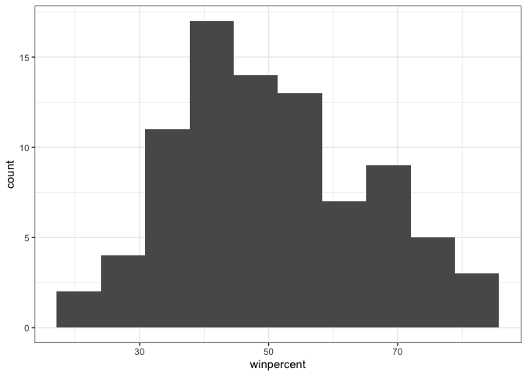
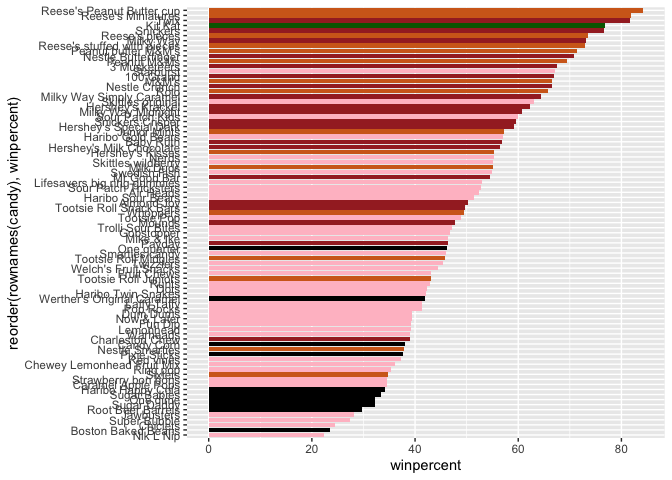

# Class 9: Halloween Candy Mini-Project
Morgan Black (PID A14904860)

## Importing candy data

``` r
candy_file <- "candy-data.csv"

candy <- read.csv(candy_file,
                    row.names=1)

head(candy)
```

                 chocolate fruity caramel peanutyalmondy nougat crispedricewafer
    100 Grand            1      0       1              0      0                1
    3 Musketeers         1      0       0              0      1                0
    One dime             0      0       0              0      0                0
    One quarter          0      0       0              0      0                0
    Air Heads            0      1       0              0      0                0
    Almond Joy           1      0       0              1      0                0
                 hard bar pluribus sugarpercent pricepercent winpercent
    100 Grand       0   1        0        0.732        0.860   66.97173
    3 Musketeers    0   1        0        0.604        0.511   67.60294
    One dime        0   0        0        0.011        0.116   32.26109
    One quarter     0   0        0        0.011        0.511   46.11650
    Air Heads       0   0        0        0.906        0.511   52.34146
    Almond Joy      0   1        0        0.465        0.767   50.34755

### Q1: How many different candy types are in this dataset?

``` r
nrow(candy)
```

    [1] 85

### Q2: How many fruity candy types are in the dataset?

``` r
table(candy$fruity)
```


     0  1 
    47 38 

There are 38 fruity candy types.

## What is your favorite candy?

### Q3: What is your favorite candy in the dataset and what is its ‘winpercent’ value?

``` r
candy["Kit Kat",]$winpercent
```

    [1] 76.7686

My favorite candy in the dataset are Kit Kats, and their win percent
value is 76.7686%.

### Q4: What’s the winpercent value for Kit Kat?

``` r
#I didn't notice this was the next question, Kit Kats truly are my favorite 
#for Q3!

candy["Kit Kat",]$winpercent
```

    [1] 76.7686

### Q5: What’s the winpercent value for Tootsie roll snack bars?

``` r
candy["Tootsie Roll Snack Bars",]$winpercent
```

    [1] 49.6535

``` r
#Or use dplyr package to get the same information
#library(dplyr)
#candy |>
#  filter(rownames(candy)=="Tootsie Roll Snack Bars") |>
#  select(winpercent)

#or
#candy |>
#  filter(rownames(candy) %in% c("Kit Kat",
#                                "Tootsie Roll Snack Bars")) |>
#   select(winpercent)
```

``` r
#install.packages("skimr")
library("skimr")
skim(candy)
```

|                                                  |       |
|:-------------------------------------------------|:------|
| Name                                             | candy |
| Number of rows                                   | 85    |
| Number of columns                                | 12    |
| \_\_\_\_\_\_\_\_\_\_\_\_\_\_\_\_\_\_\_\_\_\_\_   |       |
| Column type frequency:                           |       |
| numeric                                          | 12    |
| \_\_\_\_\_\_\_\_\_\_\_\_\_\_\_\_\_\_\_\_\_\_\_\_ |       |
| Group variables                                  | None  |

Data summary

**Variable type: numeric**

| skim_variable | n_missing | complete_rate | mean | sd | p0 | p25 | p50 | p75 | p100 | hist |
|:---|---:|---:|---:|---:|---:|---:|---:|---:|---:|:---|
| chocolate | 0 | 1 | 0.44 | 0.50 | 0.00 | 0.00 | 0.00 | 1.00 | 1.00 | ▇▁▁▁▆ |
| fruity | 0 | 1 | 0.45 | 0.50 | 0.00 | 0.00 | 0.00 | 1.00 | 1.00 | ▇▁▁▁▆ |
| caramel | 0 | 1 | 0.16 | 0.37 | 0.00 | 0.00 | 0.00 | 0.00 | 1.00 | ▇▁▁▁▂ |
| peanutyalmondy | 0 | 1 | 0.16 | 0.37 | 0.00 | 0.00 | 0.00 | 0.00 | 1.00 | ▇▁▁▁▂ |
| nougat | 0 | 1 | 0.08 | 0.28 | 0.00 | 0.00 | 0.00 | 0.00 | 1.00 | ▇▁▁▁▁ |
| crispedricewafer | 0 | 1 | 0.08 | 0.28 | 0.00 | 0.00 | 0.00 | 0.00 | 1.00 | ▇▁▁▁▁ |
| hard | 0 | 1 | 0.18 | 0.38 | 0.00 | 0.00 | 0.00 | 0.00 | 1.00 | ▇▁▁▁▂ |
| bar | 0 | 1 | 0.25 | 0.43 | 0.00 | 0.00 | 0.00 | 0.00 | 1.00 | ▇▁▁▁▂ |
| pluribus | 0 | 1 | 0.52 | 0.50 | 0.00 | 0.00 | 1.00 | 1.00 | 1.00 | ▇▁▁▁▇ |
| sugarpercent | 0 | 1 | 0.48 | 0.28 | 0.01 | 0.22 | 0.47 | 0.73 | 0.99 | ▇▇▇▇▆ |
| pricepercent | 0 | 1 | 0.47 | 0.29 | 0.01 | 0.26 | 0.47 | 0.65 | 0.98 | ▇▇▇▇▆ |
| winpercent | 0 | 1 | 50.32 | 14.71 | 22.45 | 39.14 | 47.83 | 59.86 | 84.18 | ▃▇▆▅▂ |

### Q6: Is there any variable/column that looks to be on a different scale to the majority of the other columns in the dataset?

The ‘winpercent’ variable is on a very different scale compared to the
rest of the variables, since this is measured as a percent from 0-100,
while the majority of the other variable measurements are a binary of 0
or 1.

### Q7: What do you think a zero and one represent for the candy\$chocolate column?

The 0 represents a “no” or “false”, and the 1 represents “yes” or
“true”. If a candy has a 0 in the chocolate variable column, it doesn’t
have chocolate in it, and if it has a 1 then it does have chocolate.

### Q8: Plot a histogram of winpercent values.

``` r
hist(candy$winpercent)
```


``` r
library(ggplot2)
ggplot(candy, aes(winpercent)) +
  geom_histogram(bins=10) +
  theme_bw()
```



### Q9: Is the distribution of winpercent values symmetrical?

No, the data shown in the histogram has a positive/right skew with most
of the data centered around 30-60% and a tail extending out towards
100%.

### Q10: Is the center of the distribution above or below 50%?

The center is below 50%.

### Q11: On average, is chocolate candy higher or lower ranked than fruit candy?

``` r
mean(candy$winpercent[as.logical(candy$chocolate)])
```

    [1] 60.92153

``` r
mean(candy$winpercent[as.logical(candy$fruity)])
```

    [1] 44.11974

Chocolate candy is ranked higher on average than fruit candy. The
average win percent for chocolate candy is around 61% while the average
win percent for fruit candy is 44%.

### Q12: Is the difference in Q11 statistically significant?

``` r
chocolate_candy <- as.logical(candy$chocolate)
chocolate_winpercent <- candy[chocolate_candy,]$winpercent

fruit_candy <- as.logical(candy$fruity)
fruit_winpercent <- candy[fruit_candy,]$winpercent

t.test(chocolate_winpercent, fruit_winpercent)
```


        Welch Two Sample t-test

    data:  chocolate_winpercent and fruit_winpercent
    t = 6.2582, df = 68.882, p-value = 2.871e-08
    alternative hypothesis: true difference in means is not equal to 0
    95 percent confidence interval:
     11.44563 22.15795
    sample estimates:
    mean of x mean of y 
     60.92153  44.11974 

According to this t test, there is a significant difference between the
mean winpercent values of chocolate and fruity candies. The p value is
very low at 2.87E-8.

## Overall candy rankings

### Q13: What are the five least liked candy types in this set?

``` r
library(dplyr)
```


    Attaching package: 'dplyr'

    The following objects are masked from 'package:stats':

        filter, lag

    The following objects are masked from 'package:base':

        intersect, setdiff, setequal, union

``` r
candy %>%
  arrange(winpercent) %>%
  head(5)
```

                       chocolate fruity caramel peanutyalmondy nougat
    Nik L Nip                  0      1       0              0      0
    Boston Baked Beans         0      0       0              1      0
    Chiclets                   0      1       0              0      0
    Super Bubble               0      1       0              0      0
    Jawbusters                 0      1       0              0      0
                       crispedricewafer hard bar pluribus sugarpercent pricepercent
    Nik L Nip                         0    0   0        1        0.197        0.976
    Boston Baked Beans                0    0   0        1        0.313        0.511
    Chiclets                          0    0   0        1        0.046        0.325
    Super Bubble                      0    0   0        0        0.162        0.116
    Jawbusters                        0    1   0        1        0.093        0.511
                       winpercent
    Nik L Nip            22.44534
    Boston Baked Beans   23.41782
    Chiclets             24.52499
    Super Bubble         27.30386
    Jawbusters           28.12744

``` r
#I prefer the dplyr method of sorting the dataset because the code makes 
#more logical sense to me as written
```

Nik L Nip, Boston Baked Beans, Chiclets, Super Bubble, and Jawbusters

### Q14: What are the top 5 favorite candy types from this set?

``` r
candy %>%
  arrange(desc(winpercent)) %>%
  head(5)
```

                              chocolate fruity caramel peanutyalmondy nougat
    Reese's Peanut Butter cup         1      0       0              1      0
    Reese's Miniatures                1      0       0              1      0
    Twix                              1      0       1              0      0
    Kit Kat                           1      0       0              0      0
    Snickers                          1      0       1              1      1
                              crispedricewafer hard bar pluribus sugarpercent
    Reese's Peanut Butter cup                0    0   0        0        0.720
    Reese's Miniatures                       0    0   0        0        0.034
    Twix                                     1    0   1        0        0.546
    Kit Kat                                  1    0   1        0        0.313
    Snickers                                 0    0   1        0        0.546
                              pricepercent winpercent
    Reese's Peanut Butter cup        0.651   84.18029
    Reese's Miniatures               0.279   81.86626
    Twix                             0.906   81.64291
    Kit Kat                          0.511   76.76860
    Snickers                         0.651   76.67378

Reese’s PB cups, Reese’s miniatures, Twix, Kit Kats, and Snickers

### Q15: Make a barplot of candy ranking based on winpercent values.

``` r
ggplot(candy) +
  aes(winpercent, rownames(candy)) +
  geom_col()
```


### Q16: Now use the reorder() function to get the bars sorted by wnpercent to clean up the plot a bit.

``` r
ggplot(candy) +
  aes(winpercent, reorder(rownames(candy), winpercent)) +
  geom_col()
```


``` r
#Set up a color vector to use for the plot by types of candy
#First make a vector of all black values for each candy.
my_cols = rep("black", nrow(candy))

#Then overwrite the vector to create colors for different candy types
my_cols[as.logical(candy$chocolate)] = "chocolate"
my_cols[as.logical(candy$bar)] = "brown"
my_cols[as.logical(candy$fruity)] = "pink"

#Color my favorite candy in the plot my favorite color
my_cols[rownames(candy) == "Kit Kat"] = "darkgreen"

#Now plot again with these colors
ggplot(candy) + 
  aes(winpercent, reorder(rownames(candy),winpercent)) +
  geom_col(fill=my_cols) 
```



``` r
  #Use fill=mycols (makes the entire bar the desired color) here instead of 
  #col=my_cols (which would only make the outline of the bars the desried color, 
  #no good)
```

### Now, using this plot we can answer:

### Q17: What is the worst ranked chocolate candy?

Sixlets

### Q18: What is the best ranked fruity candy?

Starburst

## Taking a look at pricepercent

``` r
#Scatterplot of winpercent vs pricepercent with clear labels on each point

library(ggrepel)
ggplot(candy) +
  aes(winpercent, pricepercent, label=rownames(candy)) +
  geom_point(col=my_cols) +
  geom_text_repel (col=my_cols, size=3.3 ,max.overlaps=5)
```

    Warning: ggrepel: 50 unlabeled data points (too many overlaps). Consider
    increasing max.overlaps


## Q19: Which candy type is the highest ranked in terms of winpercent for the least money?

Based on the plot above, Reese’s miniatures are the highest ranked
winpercent for the lowest pricepercent.

## Q20: What are the top 5 most expensive candy types in the dataset, and of these, which is the least popular?

``` r
ord <- order(candy$pricepercent, decreasing=TRUE)
head(candy[ord, c(11,12)], n=5)
```

                             pricepercent winpercent
    Nik L Nip                       0.976   22.44534
    Nestle Smarties                 0.976   37.88719
    Ring pop                        0.965   35.29076
    Hershey's Krackel               0.918   62.28448
    Hershey's Milk Chocolate        0.918   56.49050

The top 5 most expensive types are Nik L Nip, Nestle Smarties, Ring pop,
Hershey’s Krackel, Hershey’s Milk chocolate. The least popular of these
is Nik L Nip.

### Q21: Make a barplot again with geom_col() this time using pricepercent and then improve this step by step, first ordering the x-axis by value and finally making a so called “dot chat” or “lollipop” chart by swapping geom_col() for geom_point() + geom_segment().

``` r
#ggplot(candy) +
#  aes(pricepercent, rownames(candy)) +
#  geom_col()

#ggplot(candy) +
#  aes(pricepercent, reorder(rownames(candy), pricepercent)) +
#  geom_col()

ggplot(candy) +
  aes(pricepercent, reorder(rownames(candy), pricepercent)) +
  geom_segment(aes(yend = reorder(rownames(candy), pricepercent), 
                   xend = 0), col="gray40") +
    geom_point()
```


## Exploring the correlation structure

``` r
library(corrplot)
```

    corrplot 0.95 loaded

``` r
cij <- cor(candy)
corrplot(cij)
```


### Q22: What two variables are anti-correlated?

Fruity and chocolate are the most anti-correlated variables.

### Q23: What two variables are the most positively correlated?

Chocolate and winpercent are most strongly correlated, meaning chocolate
candies are correlated with high winpercent values.

## Principal Component Analysis

``` r
pca <- prcomp(candy, scale=TRUE)
summary(pca)
```

    Importance of components:
                              PC1    PC2    PC3     PC4    PC5     PC6     PC7
    Standard deviation     2.0788 1.1378 1.1092 1.07533 0.9518 0.81923 0.81530
    Proportion of Variance 0.3601 0.1079 0.1025 0.09636 0.0755 0.05593 0.05539
    Cumulative Proportion  0.3601 0.4680 0.5705 0.66688 0.7424 0.79830 0.85369
                               PC8     PC9    PC10    PC11    PC12
    Standard deviation     0.74530 0.67824 0.62349 0.43974 0.39760
    Proportion of Variance 0.04629 0.03833 0.03239 0.01611 0.01317
    Cumulative Proportion  0.89998 0.93832 0.97071 0.98683 1.00000

``` r
#Plot PCA score plot of PC1 vs PC2
plot(pca$x[,1], pca$x[,2], col=my_cols, pch=16)
```


``` r
#To make a ggplot plot, first make a new data frame with our PCA results 
  #(PC1-3) and candy data together
my_data <- cbind(candy, pca$x[,1:3])

p <- ggplot(my_data) +
      aes(PC1, PC2,
          size=winpercent/100,
          text=rownames(my_data),
          label=rownames(my_data)) +
      geom_point(col=my_cols)
p
```


``` r
#Use ggrepel to label with non-overlapping names 

p + geom_text_repel(size=3.3, col=my_cols, max.overlaps = 7)  + 
  theme(legend.position = "none") +
  labs(title="Halloween Candy PCA Space",
       subtitle="Colored by type: chocolate bar (dark brown), chocolate other 
       (light brown), fruity (pink), other (black)",
       caption="Data from 538")
```

    Warning: ggrepel: 40 unlabeled data points (too many overlaps). Consider
    increasing max.overlaps


``` r
#Use plotly to generate an interactive plot!
#install.packages("plotly")
#library(plotly)
#ggplotly(p)
```

``` r
#Bar plot to visualize PC1 contributions 
par(mar=c(8,4,2,2))
barplot(pca$rotation[,1], las=2, ylab="PC1 Contribution")
```


### Q24: What original variables are picked up strongly by PC1 in the positive direction? Do these make sense?

The fruity, hard, and pluribus variables are strongly picked up by PC1
in the positive direction. These make sense because looking at the PC1
vs PC2 scatterplot, the candies on the rightmost part of the x axis are
mainly hard fruity candies that come in multi pack packaging. The
candies on the leftmost part of the x axis are mainly chocolate bars.
